# DevTinder-Project

# 🧑‍💻 DevTinder – Developer Matching Platform

DevTinder is a **MERN-stack** web application that enables developers to **discover, connect, and collaborate—** similar to Tinder, but built specifically for the **developer community**. Users can **create profiles, browse other developers, send connection requests, and manage their matches**.

This repo provides the backend built with Node.js, Express, and MongoDB, working alongside a React-based frontend to form the full MERN-powered DevTinder platform.

---

## 📦 Repository

GitHub Repo:
[`https://github.com/Ruthvik2000/DevTinder-Project`](https://github.com/Ruthvik2000/DevTinder-Project)

---

## 📌 1. Project Overview

DevTinder is inspired by Tinder but customized for **developers**:

- Developers create profiles with **skills, role, experience, location, bio**
- They can view a **feed** of other developers
- They can **like** or **dislike** people
- If **both** users like each other → it becomes a **match**

While building this project, the focus was on:

- Clean and modular **Node.js + Express** architecture
- Proper **MongoDB schema design**
- Production-style **authentication using JWT**
- Secure **password hashing using bcrypt**
- Implementing **feed, like/dislike and match logic**
- Using **middlewares, controllers, and routes** correctly

---

## 📌 2. Tech Stack

| Technology      | Purpose                                  |
|----------------|-------------------------------------------|
| **Node.js**    | JavaScript runtime for backend            |
| **Express.js** | Web framework for routing & middleware    |
| **MongoDB**    | NoSQL database                            |
| **Mongoose**   | ODM to model MongoDB data                 |
| **JWT**        | Authentication tokens                     |
| **bcryptjs**   | Password hashing                          |
| **dotenv**     | Environment variable management           |

---

## 📌 3. Folder Structure

```bash
DevTinder-Project/
│── server.js
│── package.json
│── .env            # Not committed, used locally
│
├── config/
│   └── db.js       # MongoDB connection
│
├── models/
│   └── User.js     # User schema (dev profile + swipe data)
│   └── Match.js    # (Optional) Match schema
│
├── middleware/
│   └── authMiddleware.js  # JWT verification
│
├── controllers/
│   └── authController.js   # register, login
│   └── userController.js   # feed, like, dislike
│   └── matchController.js  # match-related logic (if added)
│
└── routes/
    └── authRoutes.js
    └── userRoutes.js
    └── matchRoutes.js
```

I separated routes, controllers, models, and middleware to keep the project scalable and easy to maintain.

---

## 📌 4. How I Built the Project (Step by Step)

### ✅ Step 1: Express Server Setup

Created `server.js`.

Imported Express and set up:

```js
app.use(express.json()); // for JSON body parsing
```

Mounted routes under `/api`.

Connected to MongoDB using a separate `config/db.js`.

Started the server on:

```js
const PORT = process.env.PORT || 5000;
```

---

### ✅ Step 2: Database Connection (MongoDB)

In `config/db.js`:

```js
mongoose
  .connect(process.env.MONGO_URI)
  .then(() => console.log("MongoDB connected"))
  .catch((err) => {
    console.error("MongoDB connection error:", err);
    process.exit(1);
  });
```

If connection fails, the app exits early.
This guarantees the app doesn't run without DB.

---

### ✅ Step 3: User Model (Core of DevTinder)

In `models/User.js`, I designed a schema that represents a developer.

**Auth fields:**

- `name`
- `email`
- `password` (hashed)

**Dev profile fields:**

- `role` (Frontend / Backend / Fullstack / etc.)
- `skills` (array of strings)
- `experienceYears`
- `location`
- `bio`
- `github`
- `linkedin`

**Swipe system fields:**

- `likedUsers` → array of user IDs liked by this user
- `dislikedUsers` → array of user IDs disliked by this user

This schema is the heart of the matching logic.

---

### ✅ Step 4: Authentication (Register & Login)

I implemented two main routes in `authRoutes.js` and `authController.js`:

#### 🔹 Register

- Validates required fields
- Checks if email already exists
- Hashes password using `bcryptjs`
- Saves user into DB
- Generates a JWT and returns it along with minimal user info

#### 🔹 Login

- Validates email and password
- Verifies password using `bcrypt.compare`
- Generates a JWT on success
- Returns token + basic user info

The client uses this token for all protected routes.

---

### ✅ Step 5: Auth Middleware

In `middleware/authMiddleware.js`:

- Extracts the token from `Authorization: Bearer <token>` header
- Verifies the token using `jwt.verify`
- If valid, attaches `req.user = { id: <userId> }`
- If invalid, returns **401 Unauthorized**

This middleware is applied to routes like feed, like, dislike.

---

### ✅ Step 6: Developer Feed API

**Goal:** Show potential dev profiles that the current user hasn’t liked/disliked yet.

**Logic:**

1. Find current user using `req.user.id`
2. Query `User` collection and exclude:
   - The current user (`_id: { $ne: me._id }`)
   - Users in `me.likedUsers`
   - Users in `me.dislikedUsers`
3. Return the remaining users as feed

---

### ✅ Step 7: Like / Dislike Logic

#### ✔ Like

Current user sends:

```http
POST /api/users/:id/like
```

**Logic:**

- Add target `id` to `likedUsers` (if not already present)
- Check if target user has already liked me
- If yes → mark `isMatch = true`
- Return JSON:

```json
{ "message": "Liked", "isMatch": true/false }
```

#### ✔ Dislike

Current user sends:

```http
POST /api/users/:id/dislike
```

**Logic:**

- Add target `id` to `dislikedUsers` (if not already present)
- Return simple success message

---

### ✅ Step 8: Match Concept

A match is created when:

- User A likes User B
- **and** User B has already liked User A

This logic is handled inside the like API.
Optionally, we can persist matches in a `Match` model later.

---

## 📌 5. Architecture

```mermaid
flowchart TD

    ClientUI["💻 DevTinder Frontend"]

    subgraph Backend ["🧑‍💻 DevTinder Backend (Node.js + Express)"]
        AuthRoutes["🔐 Auth Routes: /register, /login"]
        UserRoutes["👥 User Routes: /users/feed, /users/:id/like, /users/:id/dislike"]
        Middleware["🛡️ Auth Middleware (JWT Verify)"]
        Controllers["⚙️ Controllers: auth, user, match"]
    end

    subgraph Database ["🗄️ MongoDB"]
        UsersCol["📁 Users Collection"]
        MatchCol["💘 Matches Collection (optional)"]
    end

    ClientUI --> AuthRoutes
    ClientUI --> Middleware --> UserRoutes
    AuthRoutes --> Controllers --> UsersCol
    UserRoutes --> Controllers
    Controllers --> MatchCol
```



---

## 📌 6. API Documentation

Base URL (local):

```text
http://localhost:5000/api
```

---

### 6.1 Authentication

#### 🔐 Register User

**URL:** `POST /auth/register`
**Auth:** Public

**Request Body:**

```json
{
  "name": "Alice Developer",
  "email": "alice@example.com",
  "password": "StrongPass123",
  "role": "Fullstack",
  "skills": ["Node.js", "React", "MongoDB"],
  "experienceYears": 3,
  "location": "Phoenix, AZ",
  "bio": "Fullstack dev who loves building side projects"
}
```

**Success Response:**

```json
{
  "token": "<jwt_token>",
  "user": {
    "id": "676abc1234...",
    "name": "Alice Developer",
    "email": "alice@example.com"
  }
}
```

---

#### 🔐 Login

**URL:** `POST /auth/login`
**Auth:** Public

**Request Body:**

```json
{
  "email": "alice@example.com",
  "password": "StrongPass123"
}
```

**Success Response:**

```json
{
  "token": "<jwt_token>",
  "user": {
    "id": "676abc1234...",
    "name": "Alice Developer",
    "email": "alice@example.com"
  }
}
```

---

### 6.2 User Feed & Swipe

> All endpoints below require `Authorization: Bearer <jwt_token>`.

#### 👥 Get Feed

**URL:** `GET /users/feed`
**Auth:** Bearer Token

**Headers:**

```text
Authorization: Bearer <jwt_token>
```

**Success Response:**

```json
[
  {
    "_id": "676def1234...",
    "name": "Bob Backend",
    "email": "bob@example.com",
    "role": "Backend",
    "skills": ["Node.js", "PostgreSQL"],
    "experienceYears": 4,
    "location": "Dallas, TX",
    "bio": "Backend dev who loves APIs",
    "github": "https://github.com/bob",
    "linkedin": "https://linkedin.com/in/bob",
    "createdAt": "2025-12-08T12:34:56.789Z"
  }
]
```

---

#### ❤️ Like a User

**URL:** `POST /users/:id/like`
**Auth:** Bearer Token

**Example:** `POST /users/676def1234abcd/like`

**Headers:**

```text
Authorization: Bearer <jwt_token>
```

**Success Response – no match yet:**

```json
{
  "message": "Liked",
  "isMatch": false
}
```

**Success Response – match created:**

```json
{
  "message": "Liked",
  "isMatch": true
}
```

---

#### ❌ Dislike a User

**URL:** `POST /users/:id/dislike`
**Auth:** Bearer Token

**Example:** `POST /users/676def1234abcd/dislike`

**Headers:**

```text
Authorization: Bearer <jwt_token>
```

**Success Response:**

```json
{
  "message": "Disliked"
}
```

---

## 📌 7. Postman Collection

To make testing easier, create a file named:

```text
DevTinder.postman_collection.json
```

and paste:

```json
{
  "info": {
    "name": "DevTinder API",
    "_postman_id": "8f9a5d44-1234-4567-89ab-devtinder123456",
    "description": "Postman collection for DevTinder backend (auth, feed, like, dislike).",
    "schema": "https://schema.getpostman.com/json/collection/v2.1.0/collection.json"
  },
  "item": [
    {
      "name": "Auth - Register",
      "request": {
        "method": "POST",
        "header": [
          {
            "key": "Content-Type",
            "value": "application/json"
          }
        ],
        "body": {
          "mode": "raw",
          "raw": "{
  "name": "Alice Developer",
  "email": "alice@example.com",
  "password": "StrongPass123",
  "role": "Fullstack",
  "skills": ["Node.js", "React", "MongoDB"],
  "experienceYears": 3,
  "location": "Phoenix, AZ",
  "bio": "Fullstack dev who loves building side projects"
}"
        },
        "url": {
          "raw": "http://localhost:5000/api/auth/register",
          "protocol": "http",
          "host": ["localhost"],
          "port": "5000",
          "path": ["api", "auth", "register"]
        }
      }
    },
    {
      "name": "Auth - Login",
      "request": {
        "method": "POST",
        "header": [
          {
            "key": "Content-Type",
            "value": "application/json"
          }
        ],
        "body": {
          "mode": "raw",
          "raw": "{
  "email": "alice@example.com",
  "password": "StrongPass123"
}"
        },
        "url": {
          "raw": "http://localhost:5000/api/auth/login",
          "protocol": "http",
          "host": ["localhost"],
          "port": "5000",
          "path": ["api", "auth", "login"]
        }
      }
    },
    {
      "name": "Users - Get Feed",
      "request": {
        "method": "GET",
        "header": [
          {
            "key": "Authorization",
            "value": "Bearer {{token}}"
          }
        ],
        "url": {
          "raw": "http://localhost:5000/api/users/feed",
          "protocol": "http",
          "host": ["localhost"],
          "port": "5000",
          "path": ["api", "users", "feed"]
        }
      }
    },
    {
      "name": "Users - Like User",
      "request": {
        "method": "POST",
        "header": [
          {
            "key": "Authorization",
            "value": "Bearer {{token}}"
          }
        ],
        "url": {
          "raw": "http://localhost:5000/api/users/{{targetUserId}}/like",
          "protocol": "http",
          "host": ["localhost"],
          "port": "5000",
          "path": ["api", "users", "{{targetUserId}}", "like"]
        }
      }
    },
    {
      "name": "Users - Dislike User",
      "request": {
        "method": "POST",
        "header": [
          {
            "key": "Authorization",
            "value": "Bearer {{token}}"
          }
        ],
        "url": {
          "raw": "http://localhost:5000/api/users/{{targetUserId}}/dislike",
          "protocol": "http",
          "host": ["localhost"],
          "port": "5000",
          "path": ["api", "users", "{{targetUserId}}", "dislike"]
        }
      }
    }
  ],
  "variable": [
    {
      "key": "token",
      "value": ""
    },
    {
      "key": "targetUserId",
      "value": ""
    }
  ]
}
```

**How to use:**

- Open Postman
- Click **Import** → select this JSON file
- Call **Auth – Register**, then **Auth – Login**, copy `token`
- Put token into the Postman environment variable `{{token}}`
- Use Feed / Like / Dislike requests

---

## 📌 8. Frontend Plan (How a UI Can Use This Backend)

This is a simple React-based plan to pair with DevTinder backend.

### Pages / Components

**1. RegisterPage**

- Inputs: name, email, password, skills (comma-separated), role, experienceYears, location, bio
- On submit:
  - `POST /api/auth/register`
  - Save token → redirect to `/feed` or `/login`

**2. LoginPage**

- Inputs: email, password
- On submit:
  - `POST /api/auth/login`
  - Save token in `localStorage`
  - Redirect to `/feed`

**3. FeedPage**

- On mount:
  - Call `GET /api/users/feed` with `Authorization: Bearer <token>`
- Display one profile card at a time:
  - name, role, skills, experienceYears, location, bio
- Buttons:
  - ❤️ Like → `POST /api/users/:id/like`
  - ❌ Dislike → `POST /api/users/:id/dislike`
- If `isMatch === true`:
  - Show a modal/toast → “🎉 It’s a match!”

**4. Navbar**

- Shows logged-in user’s name
- Logout button → clears token and redirects to `/login`

**5. ProtectedRoute**

- Wrapper that checks if token exists in `localStorage`
- If missing → redirect to `/login`

---

## 📌 9. Environment Variables

Create a `.env` file in the root:

```env
PORT=5000
MONGO_URI=your_mongodb_connection_string
JWT_SECRET=your_super_secret_key
```

---

## 📌 10. Running the Project

```bash
# Clone the repo
git clone https://github.com/Ruthvik2000/DevTinder-Project.git
cd DevTinder-Project

# Install dependencies
npm install

# Run in dev mode (if nodemon is configured)
npm run dev

# Or normal start
npm start
```

API will be available at:

```text
http://localhost:5000/api
```

---

## 📌 11. Future Improvements

- Add real-time chat using Socket.io
- Add profile pictures (Cloudinary or S3)
- Add filters (by skills, experience, location)
- Add block/report functionality
- Add unit & integration tests (Jest + Supertest)
- Add rate limiting & input sanitization for security

---

## 📌 12. What I Learned

- Structuring a real-world Node.js + Express backend
- Designing MongoDB schemas for social/matching apps
- Implementing JWT-based authentication
- Using middlewares for route protection
- Building a like/dislike + match engine
- Writing clear API documentation and Postman collections

This project is a solid foundation for building production-level backend services for matching or social apps.

---

🎉 Thank You!

If you like this project, give a ⭐ on GitHub:
👉 https://github.com/Ruthvik2000/DevTinder-Project
